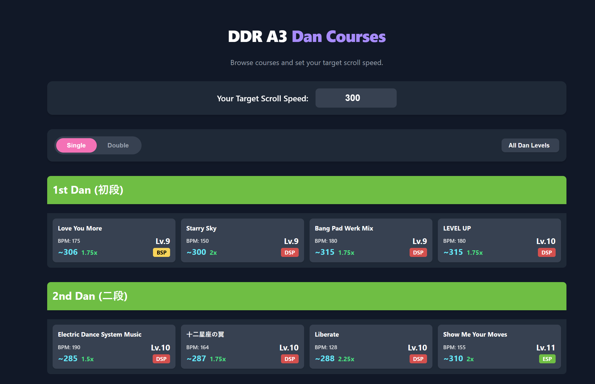

# DDR Toolkit



A modern, feature-rich web application for DanceDanceRevolution players. This tool provides scroll speed calculations, detailed song data, and advanced analysis tools to help you optimize your gameplay.

## Features

-   **BPM & Chart Visualizer**:
    -   Search for any song from the entire DDR library.
    -   View a detailed, interactive BPM graph to understand every speed change.
    -   Calculates the "core" BPM based on the most prominent speed zone.
    -   Displays all available chart difficulties (Beginner, Basic, Difficult, Expert, Challenge) for both Single and Double play.

-   **Scroll Speed Calculator**:
    -   Set your personal target scroll speed.
    -   The tool instantly recommends the best `x` multiplier to achieve your target for any song.
    -   Provides an alternative multiplier (faster or slower) to fine-tune your speed.
    -   Works for both the overall BPM range and the calculated core BPM.

-   **Dan Course Browser**:
    -   Browse all official Dan (Class) mode courses for DDR A3.
    -   Filter by Single or Double play style and specific Dan level.
    -   Each course shows the required songs with their difficulty, BPM, and a recommended multiplier based on your target speed.

-   **Simple Multiplier Tool**:
    -   A quick calculator to find a multiplier for a given song BPM and target speed.

-   **Camera-based Song Recognition (Experimental)**:
    -   Using your device's camera and a Google AI API key, the tool can identify the song currently on your game screen.

-   **Customizable Experience**:
    -   Light and Dark themes available.
    -   All settings, including your target BPM and API key, are saved in your browser for convenience.

## Tech Stack

-   **Framework**: [React](https://reactjs.org/)
-   **Build Tool**: [Vite](https://vitejs.dev/)
-   **Routing**: [React Router](https://reactrouter.com/)
-   **Charting**: [Chart.js](https://www.chartjs.org/)
-   **Styling**: CSS with dynamic theming
-   **AI Integration**: [Google AI SDK](https://ai.google.dev/)

## How to Run Locally

To get a local copy up and running, follow these simple steps.

### Prerequisites

You will need [Node.js](https://nodejs.org/en/) installed on your machine.

### Installation

1.  Clone the repository:
    ```sh
      git clone https://github.com/blackalice/ddr-dan-tool.git
    ```

2.  Navigate into the project directory:
    ```sh
    cd ddr-dan-tool
    ```

3.  Install NPM packages:
    ```sh
    npm install
    ```

4.  Run the development server:
    ```sh
    npm run dev
    ```

The application will now be running locally, typically at `http://localhost:5173`.
