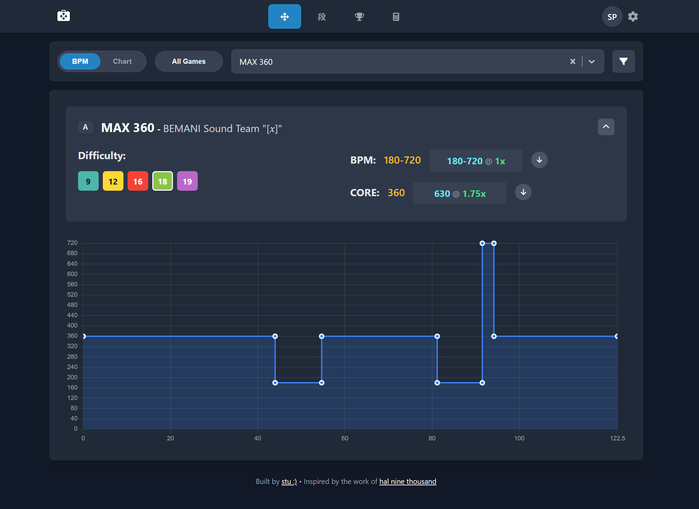

# DDR Toolkit



A modern, feature-rich web application for DanceDanceRevolution players. This tool provides scroll speed calculations, detailed song data, and advanced analysis tools to help you optimize your gameplay.

## Features

-   **BPM & Chart Visualizer**:
    -   Search for any song from the entire DDR library.
    -   View a detailed, interactive BPM graph to understand every speed change.
    -   Calculates the "core" BPM based on the most prominent speed zone.
    -   Displays all available chart difficulties (Beginner, Basic, Difficult, Expert, Challenge) for both Single and Double play.
    -   Shows the length of the selected song and supports filtering songs by length.

-   **Scroll Speed Calculator**:
    -   Set your personal target scroll speed.
    -   The tool instantly recommends the best `x` multiplier to achieve your target for any song.
    -   Provides an alternative multiplier (faster or slower) to fine-tune your speed.
    -   Works for both the overall BPM range and the calculated core BPM.

-   **Dan Course Browser**:
    -   Browse all official Dan (Class) mode courses for DDR A3.
    -   Filter by Single or Double play style and specific Dan level.
    -   Each course shows the required songs with their difficulty, BPM, and a recommended multiplier based on your target speed.

-   **Simple Multiplier Tool**:
    -   A quick calculator to find a multiplier for a given song BPM and target speed.

-   **Camera-based Song Recognition (Experimental)**:
    -   Using your device's camera and a Google AI API key, the tool can identify the song currently on your game screen.

-   **Customizable Experience**:
    -   Light and Dark themes available.
    -   All settings, including your target BPM and API key, are saved in your browser for convenience.

## Tech Stack

-   **Framework**: [React](https://reactjs.org/)
-   **Build Tool**: [Vite](https://vitejs.dev/)
-   **Routing**: [React Router](https://reactrouter.com/)
-   **Charting**: [Chart.js](https://www.chartjs.org/)
-   **Styling**: CSS with dynamic theming
-   **AI Integration**: [Google AI SDK](https://ai.google.dev/)

## How to Run Locally

To get a local copy up and running, follow these simple steps.

### Prerequisites

You will need [Node.js](https://nodejs.org/en/) installed on your machine.

### Installation

1.  Clone the repository:
    ```sh
      git clone https://github.com/blackalice/ddr-dan-tool.git
    ```

2.  Navigate into the project directory:
    ```sh
    cd ddr-dan-tool
    ```

3.  Install NPM packages:
    ```sh
    npm install
    ```

4.  Run the development server:
    ```sh
    npm run dev
    ```

The application will now be running locally, typically at `http://localhost:5173`.

### Auth & Database

- Backend endpoints live under `/api`:
  - `/api/signup`, `/api/login`, `/api/refresh`, `/api/logout`
  - `/api/user/data` for syncing settings and scores
  - `/api/parse-scores` for parsing Ganymede HTML (requires auth)

- Local development uses Cloudflare Wrangler with a local D1 DB. Ensure:
  - Node.js 18+ installed
  - Wrangler installed: `npm i -g wrangler` and logged in: `wrangler login`
  - A local JWT secret in `.dev.vars`:
    - `JWT_SECRET="your-super-secret-jwt-key"`

- Start dev: `npm run dev` (runs Vite and Wrangler). Vite proxies `/api/*` to the Worker at `http://localhost:8787`.

- Workflow:
  1. Visit `/signup` to create an account.
  2. Log in at `/login`.
  3. The app sets an `httpOnly` cookie and syncs settings/scores via `/api/user/data`.

- Production:
  - Create/bind a D1 database (update `wrangler.jsonc` if needed).
  - Add `JWT_SECRET` with `wrangler secret put JWT_SECRET`.
  - Deploy with `npm run deploy`.

## Deploying to Cloudflare Workers

This project uses a Cloudflare Worker to serve the built React application and expose a simple API powered by the [Hono](https://hono.dev/) framework.

1.  Build and deploy using Wrangler:
    ```sh
    npm run deploy
    ```

2.  The worker exposes an example endpoint at `/api/hello` returning a greeting in JSON.

3.  You can also POST a Ganymede score HTML dump to `/api/parse-scores`. The body
    may be raw HTML or `multipart/form-data` with a `file` field. Pass an optional
    `playtype` query parameter (`SP` or `DP`) to choose which table is parsed. The
    response is JSON in BATCH-MANUAL format.

4.  The Settings page provides a single upload box—found under **Beta Features**—
    that accepts either a JSON score dump or a raw Ganymede HTML file. You can
    get this HTML by right clicking and saving your scores page at
    `https://ganymede-cg.net/ddr/scores/**/********`. When uploading HTML, choose
    SP or DP so the correct table is parsed. Scores parsed as SP or DP are stored
    separately and only appear when that play style is selected. Any unmatched
    songs are listed in a console-style block below the upload button so you can
    easily check for issues.

The Worker configuration in `wrangler.jsonc` sets `not_found_handling` to `single_page_application` so that React Router can handle client-side routes.

### Parsing Scores Locally

Run the following script to convert a Ganymede score HTML file into JSON. You
can optionally choose the output filename and whether to parse the SP or DP
table:

```sh
npm run parse:scores <path/to/file.html> [output.json] [SP|DP]
```
